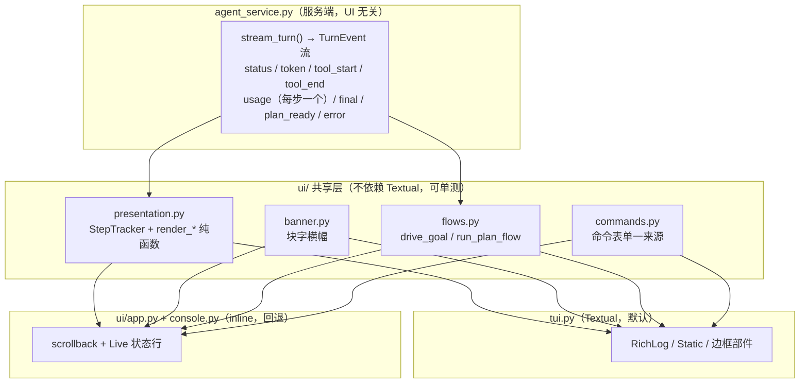

# 奶龙 Agent 仪表盘 TUI 设计文档

> v1.0 · 2026-10-01 · 目标形态：KamaClaude 风格仪表盘 TUI 为主界面

**方向确认**：采用截图风格作为主界面形态 —— 块字横幅 + 顶部状态栏 + 按 step 分块的输出 + 圆角边框输入框 + 框内两列命令菜单。此前"默认 inline"的判断被推翻，本文档以仪表盘为默认目标。

---

## 0. 文档定位

| 项 | 说明 |
|---|---|
| 读者 | ① 作者本人作为实现依据；② 评审/面试官作为工程能力展示 |
| 范围 | 基于**当前已实现进度**（§1）设计仪表盘 TUI 的目标形态与实施路线 |
| 状态标记 | ✅ 已实现 · 🔨 待实现 · ♻️ 需重构 · ⏸ 明确不做 |
| 关联文档 | [2026-09-30-nailong-agent-v1-design.md](2026-09-30-nailong-agent-v1-design.md)（v1.1 总体设计）· `docs/superpowers/specs/2026-09-26-local-cli-agent-design.md`（v0.2） |

---

## 1. 当前进度基线（已实测核对）

### 1.1 规模与测试

| 项 | 事实 |
|---|---|
| 测试 | **201 个用例**，14 个模块（`test_agent` `test_agent_service` `test_cli` `test_config` `test_headless` `test_local_tools` `test_nailong_files` `test_permissions` `test_sessions` `test_tool_registry` `test_tools` `test_tui` `test_ui` `test_v1_features`） |
| 核心模块 | `agent_service.py` 915 行 · `main.py` 646 行 · `agent.py` 285 行 |
| `nailong/` 包 | 约 2700 行（`core/`：permissions · goal · sessions · hooks · compact · commands · plan · costs · memory；`tools/`：files · registry · previews · agents） |
| 界面 | `tui.py` 823 行（Textual）· `ui/` 合计 1515 行（app 718 · render 250 · console 170 · prompt 168 · markdown_stream 124 · approval 46 · theme 37） |
| 依赖 | langchain 1.4 · langgraph 1.2 · textual 8.2 · prompt_toolkit 3 · rich 13.7+ · langgraph-checkpoint-sqlite |

### 1.2 两条界面路径现状

| 能力 | inline（`ui/`） | textual（`tui.py`） |
|---|---|---|
| 流式 token + Markdown 块渲染 | ✅ 块级缓冲 + 语法高亮 | ⚠️ 有 `#live-response`，但无块级 Markdown |
| 工具卡片 / diff / 命令输出预览 | ✅ `⏺`/`✓` + 内联 diff + 输出预览 | ❌ **完全忽略 `tool_start`/`tool_end`** |
| 逐 step token 统计 | ❌ 仅总量 | ❌ 无 |
| 权限引擎（规则 + 模式） | ✅ `ui/app.py:112` 注入 `PermissionEngine` | ❌ **`tui.py:802-806` 未注入 → 两种界面权限行为不同** |
| 命令集 | 20 条（含 `/plan` `/goal` `/cost` `/context` `/compact`） | 13 条（缺上述 5 条） |
| 计划模式 / 目标模式流程 | ✅ 内联实现（`ui/app.py:552-608`、`:180-240`） | ❌ 未接入 |
| 会话恢复 / rewind | ✅ `/sessions` 表格 + `/resume` 选择 | ⚠️ 仅 CLI 参数 + 弹窗确认 |
| 固定边框 / 常驻状态栏 | ❌ 无（inline 本质） | ✅ 已有 `#topbar` `#transcript` `#composer-frame` 圆角边框 |
| 命令菜单 | ✅ prompt_toolkit 补全（行内） | ✅ 框内 Static 列表（`tui.py:450-500`），但提示在框外、描述未对齐 |
| 块字横幅 | ❌ 无 | ❌ 无 |

### 1.3 与截图的元素级差距

| 截图元素 | 现状 | 差距 |
|---|---|---|
| `KAMACLAUDE` 块字横幅 | 无 | 🔨 需新增 |
| 顶部状态栏 `名称 · 地址 · sess-id · ready` | `#topbar` 有名称/项目/sess/状态 | 🔨 补模型名；状态字形换盲文点阵 |
| 提示行 `输入消息开始对话 · 输入 / 触发 skill · Ctrl+C 退出` | `#footer` 有全局快捷键 | 🔨 拆成"提示行 + 全局快捷键行" |
| `run <ts>-<id>  <消息>` | 无 | 🔨 需新增 |
| `step N` | 无 | 🔨 需新增 |
| `tokens im=81 out=87 cache=1536 ctx:0.0%` | 无 | 🔨 需**服务端每步发 usage**（§5.1）+ 窗口长度配置 |
| `tool_read_file path='pyproject.toml'  done  0ms` | inline 有紧凑卡片；TUI 无 | 🔨 需新增工具行 |
| `✓ completed · 2 steps` | 无 | 🔨 需新增 |
| 圆角边框输入框（框内灰色占位符） | TUI 有边框，提示在框上方 | 🔨 占位符移入框内 |
| 框内两列命令菜单 + `↑↓ navigate …` | TUI 有菜单，提示在框外 | 🔨 列对齐 + 提示移入框内 |
| `(click to expand)` | 无 | ⏸ **不做**（§2.3） |

### 1.4 基线缺陷（实测发现，必须在动界面之前修）

**测试套件约 50% 概率失败**，与应用逻辑无关，但会让后续每一次界面改动都无法验证：

- **现象**：干净单进程连续 6 轮，失败 3 次。失败用例为
  - `test_cli.CliTests.test_run_turn_prompts_for_each_tool_and_resumes_in_order` —— `StopIteration`：测试只准备了 2 个审批答复（`iter(["a","r"])`），代码却第 3 次请求审批；
  - `test_headless.HeadlessTests.test_headless_approval_request_is_rejected_without_writing_file`。
- **根因（实施中确认）**：服务层收到 `__interrupt__` 后直接跳出 `agent.astream`，没有等待异步流关闭，随即恢复同一线程。LangGraph 的中断 checkpoint 尚未稳定落定时，同一组操作可能再次请求审批。哈希种子与失败相关，但不是已证实的集合遍历根因。
- **已排除**：单独跑 `test_cli` 6/6 通过；`test_agent + test_agent_service + test_cli` 5/5 通过；`-k` 只跑该用例 5/5 通过 → 不是导入期副作用，也不是简单的模块间污染。

---

## 2. 目标与非目标

### 2.1 目标

1. **仪表盘为默认形态**：`python main.py` 在支持全屏的终端启动即呈现 §3 的布局。
2. **信息密度对齐截图**：每轮可见 run 头、逐 step 的 token 记账、逐个工具行、结束统计。
3. **两条路径语义一致**：权限规则、命令集、计划/目标流程在 inline 与 textual 下行为完全相同。
4. **降级可用**：窄终端、`NO_COLOR`、ASCII 终端、IDE 控制台（PyCharm Run）都有可用形态。
5. **测试可信**：修掉 §1.4 的偶发失败后，201 个用例必须连续多轮全绿，作为后续改动的基线。

### 2.2 不变量

沿用总体设计文档 I1–I8（密钥不落盘不外泄、路径围栏、硬拒绝优先、未批准即零发生、旧测试不红、循环有界、审批默认拒绝、审批路径唯一），并新增 UI 侧三条：

| ID | 不变量 |
|---|---|
| I9 | 渲染层新增的任何输出路径（横幅、step 行、工具行、占位符、菜单）都必须过密钥脱敏，且新增纯函数测试断言 |
| I10 | 界面不得改变服务端语义：`--ui` 的切换不改变工具集、权限决策、事件内容 |
| I11 | 任何降级（窄终端/无色/ASCII/IDE）都不得隐藏安全信息：审批内容、目标状态、失败原因必须仍可见 |

### 2.3 非目标

- ⏸ **(click to expand) 折叠/展开工具输出**：完整工具结果不在事件流中（`_tool_result_summary` 只给摘要 + `diff` + `output_snippet`），要做需改服务端载荷策略，另立方案。
- ⏸ KamaClaude 的 `kama-core` 守护进程 / TCP loopback 架构：那是进程模型改造，与本设计目标无关。
- ⏸ 不引入 figlet 等新依赖（手写块字，见 ADR-015）。
- ⏸ 不删除 inline 路径（它是 IDE 控制台与 SSH 场景的回退，也是 I11 的保障）。
- ⏸ 不做鼠标交互、不做多窗口/分屏。

---

## 3. 界面设计

### 3.1 布局

```text
┌──────────────────────────────────────────────────────────────┐
│  ███  ███  ███  ███          ← #banner（块字，可关闭）        │
│  奶龙 Agent  deepseek-flash  项目名  sess-1f69ff22  ● 就绪    │  ← #topbar
│  输入消息开始对话 · 输入 / 触发命令 · Ctrl+C 退出              │  ← #hint
├──────────────────────────────────────────────────────────────┤
│  run 20261001-113512-cc3313  用一句话介绍这个项目             │  ← transcript
│  step 1                                                      │
│        tokens im=81 out=87 cache=1536 ctx:0.0%               │
│        tool_list_dir path='.' max_depth=3   done   11ms      │
│  step 2                                                      │
│        tokens im=1080 out=99 cache=1664 ctx:0.7%             │
│        tool_read_file path='pyproject.toml'  done   0ms      │
│  step 3                                                      │
│        tokens im=1149 out=79 cache=3200 ctx:0.6%             │
│  奶龙 Agent 是一个本地编码 Agent …                            │
│  ✓ completed · 3 steps                                       │
├──────────────────────────────────────────────────────────────┤
│  › /compact    compress context window                       │  ← #command-menu
│    /init       分析当前项目，生成 .nailong/context.md         │
│    ↑↓ 选择   Tab/Enter 选中   Esc 关闭                        │
├──────────────────────────────────────────────────────────────┤
│  ┌────────────────────────────────────────────────────────┐  │
│  │ 输入消息，Enter 发送，Ctrl+Enter 换行                    │  │  ← #composer-frame
│  └────────────────────────────────────────────────────────┘  │     框内占位符
└──────────────────────────────────────────────────────────────┘
```

### 3.2 部件映射

| 截图元素 | Textual 部件 | inline 对应 |
|---|---|---|
| 块字横幅 | `Static#banner`（Rich `Text`，逐行着色） | 启动时打印一次，随 scrollback 流走 |
| 顶部状态栏 | `Horizontal#topbar`（brand / 模型 / 项目 / sess / status） | `bottom_toolbar`（`ui/app.py:150`） |
| 提示行 | `Static#hint` | 输入框上方一行 |
| 对话区 | `RichLog#transcript` + `Static#live-response` | scrollback + Rich `Live` 状态行 |
| run 头 / step 头 / token 行 / 工具行 / 完成行 | 由 `ui/presentation.py` 产出，写入 `RichLog` | 同一函数产出，直接 `print` |
| 命令菜单 | `Static#command-menu`（两列 + 框内提示） | prompt_toolkit 补全菜单 |
| 输入框 | `Vertical#composer-frame` + `Static#composer-placeholder` + `ChatInput` | `PromptSession` + `bottom_toolbar` |

### 3.3 渲染时序（一次对话）

```text
用户提交
 └─ run 头：run <ts>-<short>  <消息>
     ├─ step N 头 ──► 由 usage 事件触发，step 计数 +1
     │   ├─ token 行：tokens im=… out=… cache=… ctx:…%
     │   └─ 工具行（每个 tool_end 一行）：tool_<名> <参数摘要>  done  <耗时>
     │        └─ 若带 diff / output_snippet，附后续缩进行
     └─ 完成行：✓ completed · N steps（失败时 ✗ failed · N steps）
```

`approval_needed` 不改变 step 计数；审批弹窗关闭后继续当前 step。

### 3.4 键位

| 键 | 行为 |
|---|---|
| `Enter` | 发送 |
| `Ctrl+Enter` / `Shift+Enter` | 换行 |
| `/` | 打开命令菜单；`↑↓` 移动，`Tab`/`Enter` 选中，`Esc` 关闭 |
| `Ctrl+C` | 退出（现有 priority binding） |
| `Ctrl+O` | 展开/折叠最近一次工具输出（⏸ 依赖 §2.3，暂不实现） |
| `Ctrl+L` | 清屏 |

### 3.5 降级规则

| 条件 | 行为 |
|---|---|
| `72 ≤ width < 80` 且 `height ≥ 24` | 横幅降级为单行 `奶龙 Agent · NAILONG` |
| `width < 72` 或 `height < 24` | 隐藏 `#banner` 与 `#hint`；`#transcript`/`#composer-frame` 去圆角与边距（扩展 `tui.py:388` 的 compact 逻辑） |
| `NO_COLOR=1` | 关闭全部着色，保留字形与布局 |
| ASCII 终端 / `LC_ALL=C` | 字形走 `Theme` 的 ASCII 回退（`> + !`）；横幅降级单行；边框按 `load_theme` 判定是否可用 |
| IDE 控制台（`PYCHARM_HOSTED` / 非 TTY） | `auto` 策略下走 plain，避免 prompt_toolkit 对非终端输入报错；能使用交互行编辑的 TTY、但不适合全屏时走 inline |
| 模型无价格 / 无上下文窗口配置 | 整段省略 `ctx:` 与费用，不显示 `0.0%`、`$0.000000` |

---

## 4. 架构

### 4.1 数据流



**依赖方向不可逆**：`tui.py` 与 `ui/app.py` 只依赖 `ui/` 共享层与服务层；共享层不得 import Textual 专属部件（`presentation.py` 可返回 Rich renderable，因为两端都能渲染 Rich 对象）。

### 4.2 模块职责

| 模块 | 职责 | 状态 |
|---|---|---|
| `ui/presentation.py` | `StepTracker` + run/step/token/工具/完成行的纯函数渲染 | 🔨 新增 |
| `ui/banner.py` | 块字横幅数据与渲染，尺寸/无色的降级判定 | 🔨 新增 |
| `ui/flows.py` | `drive_goal`、`run_plan_flow`（回调式，不依赖具体 UI） | 🔨 新增 |
| `ui/commands.py` | 命令表单一来源（含 `usage` 字段），两端共用 | 🔨 新增 |
| `tui.py` | Textual 形态；消费共享层 | ♻️ 重构 |
| `ui/app.py`、`ui/console.py` | inline 形态；改为消费共享层 | ♻️ 局部重构 |
| `agent_service.py` | 每步发 `usage`（§5.1） | ♻️ 局部改动 |
| `main.py` | `--ui` 默认策略由 `inline` 改为 `auto`（支持全屏→textual；其余按终端能力进入 inline 或 plain） | ♻️ 局部修改 |

### 4.3 默认界面策略

- `--ui auto`（**新默认**）：`main.py:399` 判定支持全屏 → `textual`；否则若 `_supports_inline_ui()` 成立 → `inline`；其余走 `plain`。
- `--ui textual` / `--ui inline` / `--ui plain`：显式覆盖，行为不变。
- 理由：以仪表盘为目标形态，但 IDE 控制台与非 TTY 环境必须自动退回 inline（I11 与既有 `_supports_fullscreen_tui` 的既有价值）。

---

## 5. 核心机制

### 5.1 每步 `usage` 事件（服务端改动）

**现状**：`agent_service.py:690-691` 在 astream 循环**结束后**才发一次 `usage`，只有最后一次模型调用的用量 → 无法做每步统计，且 `/cost` 少算前面的步。

**改动**：在 `_update_messages` 遍历命中 `AIMessage` 时（现 `:639` 分支，即一次模型步结束）发出该步 `usage`：

```python
usage = _usage_from_message(updated_message) or pending_usage
if usage:
    yield self._event(thread_id, "usage", usage)
pending_usage = None
```

循环结束只补发"仍有未发出的累积值"（末步无 `AIMessage` 更新时）。`latest_usage` 更名 `pending_usage`。**不改事件种类与字段名**，因此：

- `test_stream_turn_emits_usage_metadata_for_the_toolbar` 的单步断言仍成立（1 步 → 1 个 usage）；
- `/cost`（`ui/app.py:346-359`）与 `drive_goal` 的累加逻辑无需改动，且**成本统计变准**（每次模型调用各付一次输入费，按步累加才是真实成本）；
- 桩服务不产生 `usage` 时，`StepTracker` 退化为按 `tool_start` 起新 step，token 行显示 `tokens -`。

**兼容性论证**：这是本设计唯一触及服务端语义的改动，但它只改变 usage 的*粒度*（1 次/轮 → 1 次/步），不改变事件契约；受影响的只有"每轮恰好 1 个 usage"这一隐含假设 —— 现有测试中唯一依赖它的是单步用例，仍然成立。

### 5.2 `StepTracker`（共享展示层）

```python
@dataclass(frozen=True)
class StepState:
    step: int = 0
    input_tokens: int = 0
    output_tokens: int = 0
    cache_hit_tokens: int = 0
    context_window: int | None = None

class StepTracker:
    def observe(self, event) -> list[RenderableType]: ...
        # usage       → step += 1；产出 [step 头, token 行]
        # tool_start  → 记录名称与参数（不产出，避免与工具行重复）
        # tool_end    → 产出 [工具行]（含 done/耗时；有 diff/output_snippet 时附行）
        # final       → 产出 [完成行]，携带总步数
        # approval_needed / status / error → 不改变 step 计数
```

纯函数渲染（可单测）：

```python
render_run_header(run_id, message, *, theme) -> Text
render_step_header(step, *, theme) -> Text
render_step_tokens(state, *, theme) -> Text          # tokens im=… out=… cache=… ctx:…%
render_tool_line(data, *, width, theme) -> Text      # tool_<名> <参数摘要>   done   <ms>
render_completion(steps, *, ok, theme) -> Text       # ✓ completed · N steps
format_tool_args(name, preview, *, limit) -> str     # path='.' max_depth=3
context_percent(usage, window) -> str | None         # 无窗口 → None（整段省略）
```

宽度裁剪复用 `ui/render.py` 的 `elide_middle`；配色/字形复用 `ui/theme.py` 的 `Theme`。

### 5.3 上下文窗口配置

`.nailong/settings.json` 新增顶层键（缺省不影响现有行为）：

```json
{
  "ui": { "banner": true },
  "models": {
    "deepseek-flash": { "context_window": 1000000 }
  }
}
```

内置默认表：`deepseek-flash` / `deepseek-v4-flash` / `deepseek-v4-pro` = 1_000_000，`deepseek-chat` = 65_536。解析沿用 `CostEstimator._configured_price`（`nailong/core/costs.py:33-50`）的安全风格：限定项目根内、异常吞掉、非法值忽略。

### 5.4 权限语义对齐（修既有缺陷）

`tui.py:802-806` 构造 `AgentService` 时未传 `permission_engine`，而 `ui/app.py:112` 传了。改为两端一致注入 `PermissionEngine(settings.project_root)`。这是 I10（界面不改变服务端语义）的具体落地。

### 5.5 命令与流程单一来源

- `ui/commands.py`：命令表（名称/描述/用法/是否需要参数/profile），两端导入；补齐 `/plan` `/goal` `/cost` `/context` `/compact`。
- `ui/flows.py`：
  - `drive_goal(service, factory, goal_store, cost_estimator, goal, *, thread_id, emit, status, approval)` —— 自 `ui/app.py:180-240` 抽取，护栏逻辑不变（成本上限、轮数上限、同因阻塞 3 轮、空转 2 轮、无人值守→暂停）。
  - `run_plan_flow(service, factory, *, thread_id, config, prompt_message, emit, confirm, edit, approval, status)` —— 自 `ui/app.py:552-608` 抽取；`confirm(draft) -> "approve"|"edit"|"reject"` 与 `edit(draft) -> str` 由各 UI 实现（inline 用 `prompt_async`，Textual 用 `push_screen_wait`）。

---

## 6. 接口契约

```python
# ui/presentation.py
def render_run_header(run_id: str, message: str, *, theme: Theme | None = None, api_key: str = "") -> Text
def render_step_header(step: int, *, theme: Theme | None = None) -> Text
def render_step_tokens(state: StepState, *, theme: Theme | None = None) -> Text
def render_tool_line(data: dict, *, width: int = 80, theme: Theme | None = None) -> Text
def render_completion(steps: int, *, ok: bool = True, theme: Theme | None = None) -> Text
def format_tool_args(name: str, preview: dict | None, *, limit: int = 60) -> str
def context_percent(usage: dict, window: int | None) -> str | None
class StepTracker:
    def __init__(self, *, context_window: int | None = None) -> None: ...
    def observe(self, event) -> list  # list[RenderableType]

# ui/banner.py
BANNER_ROWS: tuple[str, ...]
def banner_renderable(*, width: int, height: int, theme: Theme | None = None, enabled: bool = True) -> Text | None

# ui/flows.py
async def drive_goal(service, factory, goal_store, cost_estimator, goal, *, thread_id: str,
                     emit, status=None, approval=None) -> object
async def run_plan_flow(service, factory, *, thread_id: str, config: dict, prompt_message: str,
                        emit, confirm, edit, approval=None, status=None) -> bool

# ui/commands.py
@dataclass(frozen=True)
class CommandSpec:
    name: str; description: str; usage: str = ""; needs_argument: bool = False
COMMANDS: tuple[CommandSpec, ...]
COMMAND_BY_NAME: dict[str, CommandSpec]
```

**渲染契约**：`presentation.py` 的所有函数接收事件数据（dict）或事件对象，返回 Rich renderable；**不产出 ANSI 字符串、不打印、不读时钟**（时间来自事件字段），因此可在 `StringIO` 上断言。

---

## 7. 架构决策记录

### ADR-013：仪表盘（Textual）作为主界面形态，inline 保留为回退

- **背景**：v1.1 的 ADR-009 判定"全屏 TUI 方向错误，应走 inline"，前提是"目标是 Claude Code 的 inline 观感"。用户现已明确选择截图（KamaClaude）的仪表盘风格。
- **决策**：默认改为 `--ui auto`（支持全屏 → textual；其余交互 TTY → inline；非 TTY → plain）；仪表盘承载完整功能，inline 作为不适合全屏的交互终端回退。
- **理由**：① 目标形态变了，ADR-009 的前提不成立；② 截图里真正有价值的是信息设计（step 记账、工具行、常驻状态），而 Textual 是实现固定边框与两列菜单成本最低的路径；③ 保留 inline 使本仓库已经踩过的 IDE 全屏重绘问题仍有出口（I11）。
- **代价**：两份界面外壳需要同步（用 §5.5 的共享层把重复压到最低）；全屏在窄终端与 ASCII 终端需要降级规则（§3.5）。

### ADR-014：`usage` 事件改为每步一次

- **决策**：模型步结束时发 `usage`，而非整轮结束只发最后一次。
- **理由**：① 每步 token 记账是目标形态的核心信息；② 代价语义上，每次模型调用各计一次输入费，按步累加才是真实成本，现状**系统性少算**；③ 不改事件种类与字段名，破坏面最小。
- **代价**：事件变多（每步一个），JSONL 日志略增；单步用例的精确断言仍成立。

### ADR-015：手写块字横幅，不引入 figlet 依赖

- **决策**：`BANNER_ROWS` 为手写 6 行块字常量。
- **理由**：块字是静态资产，一次性写成即零成本；引入 `pyfiglet` 只为一个启动画面，违背"不自增依赖"的项目惯例（与 ADR-008 同源思想）。
- **代价**：换项目名需手工重排块字（可接受，品牌名稳定）。

### ADR-009 修订说明

原文"不继续打磨 Textual 全屏"的结论**仅在"目标为 inline 观感"时成立**。本次目标变更后，该结论作废：Textual 路径不再是过渡品，而是主界面；inline 路径的定位由"主力"改为"回退"。原文其余部分（终端所有权、迁移路径）对 inline 路径仍然有效，予以保留。

---

## 8. 实施路线

### P0：修基线偶发失败（**先于一切界面改动**）

| 项 | 内容 |
|---|---|
| 目标 | 201 个用例连续 6 轮全绿 |
| 动作 | 等待中断流关闭后再恢复同一线程；补回归用例证明恢复前已关闭流；核对图步数上限在连续审批恢复后的 checkpoint 边界 |
| 验收 | `PYTHONHASHSEED=0/1/2` 各 3 轮，全部 201 用例全绿 |

### P1：服务端每步 usage（§5.1）

| 项 | 内容 |
|---|---|
| 验收 | 3 步流 → 3 个 `usage` 且各自 token 正确；末步无 `AIMessage` 时补发一次；单步流仍恰好 1 个 |

### P2：共享展示层（§5.2、§6）

| 项 | 内容 |
|---|---|
| 交付 | `ui/presentation.py`、`ui/banner.py`、`ui/commands.py` |
| 验收 | 纯函数测试覆盖：run/step/token/工具/完成行的文本与宽度；`ctx%` 有无窗口两态；CJK 与超长路径；`StepTracker` 的事件→行序列（含缺 `usage` 的退化路径） |

### P3：Textual 主界面改造（§3、§4.2）

| 项 | 内容 |
|---|---|
| 交付 | `#banner` `#hint` 部件；`#topbar` 补模型名与盲文点阵动画；transcript 走 `StepTracker`；框内占位符；菜单两列 + 框内提示；compact 扩展 |
| 验收 | Textual 无头测试：横幅窄终端隐藏；transcript 收到 step 与工具行；占位符随输入切换；菜单列位置断言 |

### P4：功能对齐与流程共享（§5.4、§5.5）

| 项 | 内容 |
|---|---|
| 交付 | `PermissionEngine` 注入 TUI；`ui/flows.py` 抽取；TUI 接入 `/plan` `/goal` `/cost` `/context` `/compact` |
| 验收 | `ui/flows.py` 单测（目标护栏四分支、计划三条路径）；TUI 命令分发表驱动测试；两端行为一致性用例 |

### P5：inline 接入共享层与默认策略（§4.3）

| 项 | 内容 |
|---|---|
| 交付 | inline 打印 run/step/工具/完成行；`bottom_toolbar` 增 `cache`/`ctx%`；启动打印横幅一次；`--ui` 默认改 `auto` |
| 验收 | inline 输出含 run 头与 step 行；工具栏含缓存与 ctx；横幅仅打印一次；`--ui inline|textual|plain` 三态行为正确 |

### P6：文档收尾

`README.md` 增加"两种界面"小节（默认策略、截图元素对照、横幅开关）；在 v1.1 总体设计文档中标注 ADR-009 已修订并指向 ADR-013。

---

## 9. 测试策略

| 层 | 对象 | 手段 |
|---|---|---|
| 单元（纯函数） | `presentation` 全部渲染函数、`context_percent`、`format_tool_args`、`banner_renderable` | Rich 渲染到 `StringIO` 断言，无需 tty |
| 状态机 | `StepTracker.observe` 的事件→行映射 | 构造事件序列，断言产出行的种类与顺序 |
| 服务端 | 每步 usage 的粒度与补发 | 桩 agent（现有 `FakeStreamingAgent` 模式） |
| 流程 | `drive_goal` 四类护栏、`run_plan_flow` 三路径 | 桩 service/goal_store，断言 `emit` 文案与副作用 |
| 界面 | Textual 部件与命令分发 | Textual 无头测试（现有 `test_tui.py` 模式） |
| 回归 | 全量 201 用例 | `PYTHONHASHSEED=0/1/2` 各 3 轮 |

**新增测试必须不依赖真实 API 与真实 TTY**，延续现有测试风格。

---

## 10. 风险与已知限制

1. **两套界面外壳的维护成本**（ADR-013 的代价）：用 §5.5 共享层压制；若后续再次分叉，应优先考虑删除 inline 而非继续同步。
2. **全屏在受限终端退化**：`auto` 策略覆盖 IDE/非 TTY；但"支持全屏但体验差"的终端（某些 SSH 客户端）仍需用户手动 `--ui inline`。
3. **每步 usage 依赖模型返回 `usage_metadata`**：缺失时该步 token 行显示 `-`，`/cost` 会少算该步（与现状同源，不恶化）。
4. **`ctx%` 依赖配置或内置表**：新模型（非 deepseek 系列）不显示 ctx%，需用户配置。
5. **块字横幅是静态资产**：换品牌名要手工重排。
6. **(click to expand) 不实现**：截图里的展开交互不对齐（§2.3），面试演示时需口头说明这是有意的范围控制。
7. **P0 未完成前不得开始 P1–P5**：偶发失败会让每次界面改动都无法判定是否回归。

---

## 附录 A：截图元素清单（逐项对照）

| # | 截图元素 | 本文档落点 |
|---|---|---|
| 1 | 块字横幅 `KAMACLAUDE` | §3.2、§5.3、ADR-015 |
| 2 | 顶部状态栏（名称 / 地址 / sess / ready） | §3.2 |
| 3 | 提示行（输入消息 / 触发命令 / 退出） | §3.2 |
| 4 | `run <id>  <消息>` | §3.3、§5.2 |
| 5 | `step N` | §3.3、§5.2 |
| 6 | `tokens im=… out=… cache=… ctx:…%` | §5.1、§5.2、§5.3 |
| 7 | `tool_<名> <参数>  done  <ms>` | §5.2 |
| 8 | `✓ completed · N steps` | §3.3、§5.2 |
| 9 | 圆角边框输入框 + 框内占位符 | §3.2 |
| 10 | 框内两列命令菜单 + 导航提示 | §3.2、§3.4 |
| 11 | `(click to expand)` | §2.3（明确不做） |
| 12 | `127.0.0.1:7447` 守护进程地址 | §2.3（本项目无守护进程，该位显模型名） |

## 附录 B：参考资料

- [DeepSeek API · Models & Pricing](https://api-docs.deepseek.com/quick_start/pricing) — 上下文长度与缓存计价（`ctx%` 与成本口径依据）
- [Textual 文档](https://textual.textualize.io/) — 部件、CSS、`RichLog`、无头测试
- [Rich Markdown](https://rich.readthedocs.io/en/stable/markdown.html) — 代码块高亮（inline 路径已用）
- 项目内：[2026-09-30-nailong-agent-v1-design.md](2026-09-30-nailong-agent-v1-design.md)（总体设计，含 I1–I8 与 ADR-001～012）

## 实施记录（2026-10-01）

P0–P6 已实施。P0 修复审批中断流关闭时序并完成 9 轮哈希种子回归；P1 在每个模型步发出用量；P2 建立共享命令、横幅和展示层；P3 完成 Textual 仪表盘；P4 接通两端共享计划、目标与权限流程；P5 完成 inline 展示和默认 `--ui auto`；P6 更新用户说明与 ADR-009 修订说明。最终测试数量与结果以交付时的回归记录为准。
